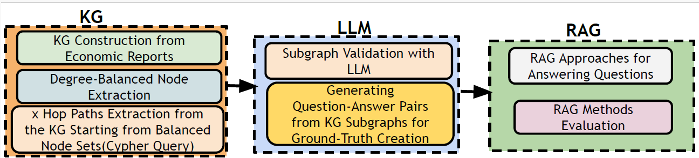

# EcoRAG: Multi-Hop Economic QA Benchmark for RAG  

*EcoRAG: A Multi-Hop Economic QA Benchmark for Retrieval-Augmented Generation Using Knowledge Graphs*  

---

**Overview**  
EcoRAG is a benchmark for testing multi-hop retrieval-augmented generation (RAG) with economic knowledge graphs.  
Unlike prior datasets (limited to 2–4 hops, shallow answers), EcoRAG:  
- Supports 4–7 hop reasoning  
- Includes linear, converging, and divergent subgraphs  
- Provides descriptive, context-rich answers  
- Uses domain-specific data (World Bank, IMF, ECB, etc.)  

---

**Features**  
- 3,114 QA pairs from 62 economic sources  
- Degree-balanced node sampling for diversity  
- Reusable pipeline for building new benchmarks  
- Evaluated on Hybrid RAG, ReRank RAG, and KG-RAG  

---

**Pipeline**  
Steps:  
1. Build KG from economic reports  
2. Sample nodes by degree  
3. Extract multi-hop paths  
4. Validate with LLM  
5. Generate Q&A pairs  
6. Evaluate with RAG methods  

Pipeline figure:  

  

---

**Results**  
- ReRank RAG performs best on converging paths (MRR up to 0.75 at 5 hops)  
- Hybrid RAG is consistent on divergent paths  
- KG-RAG struggles with deep reasoning  

---

**Resources**  
- Dataset & code: [EcoRAG Repository](https://github.com/haniehkh18/EcoRAG)  
- Paper (PDF): included in this repo  

---

**Citation**  
```bibtex
@inproceedings{khorashadizadeh2025ecorag,
  title={EcoRAG: A Multi-Hop Economic QA Benchmark for Retrieval-Augmented Generation Using Knowledge Graphs},
  author={Khorashadizadeh, Hanieh and Tiwari, Sanju and Benamara, Farah and Mihindukulasooriya, Nandana and Groppe, Jinghua and Sahri, Soror and Ezzabady, Morteza and Ieng, Fr{\'e}d{\'e}ric and Groppe, Sven},
  year={2025},
  booktitle={Proceedings of ...}
}
